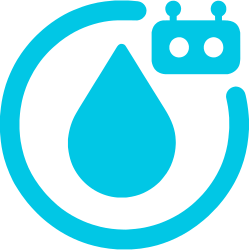

<div align="center">
    
    <h1>Aqua Habits Bot</h1>
    <p><em>Keep track of your hydration habits.</em></p>
    <br/>
    <a href="LICENSE">
        
    </a>
    <a href="https://github.com/RedMads/AquaHabits/releases/latest">
        
    </a>
    <a href="https://github.com/RedMads/AquaHabits/stargazers">
        
    </a>
    <a href="https://github.com/RedMads/AquaHabits/issues">
        
    </a>
    <a href="https://github.com/RedMads/AquaHabits/commits/main">
        
    </a>
</div>

---

## 🌊 Overview

Aqua Habits is a Telegram bot designed to help you build and maintain healthy habits with ease. Track your progress and stay motivated—all within your favorite messaging app.

👉 [Try AquaHabits on Telegram!](https://t.me/AquaHabits_bot)

---

## 🎬 Demo

<video src="assets/usage.mp4" controls width="400"></video>


## 🚀 Getting Started

### Prerequisites
- Python 3.8+
- Telegram account (bot token)

### 1. Clone the Repository
```bash
git clone https://github.com/RedMads/AquaHabits.git
cd AquaHabits/
```

### 2. Set Up a Virtual Environment
```bash
python3 -m venv .venv
source .venv/bin/activate
```

### 3. Install Dependencies
```bash
pip install -r requirements.txt
```

### 4. Run the Bot
```bash
python3 main.py
```

On first run, a `.env` file will be created. Add your `BOT_TOKEN` (from [@BotFather](https://t.me/BotFather)) and optionally set `ADMIN_USER_ID`.

## 🛠 Features
- Track daily habits
- Telegram chat interface
- Admin controls
- Easy self-hosting


## 🔒 Privacy & Data Control

Your privacy is our priority. Aqua Habits will never use your data for advertising purposes, nor will your data ever be sold or shared with third parties. All your hydration logs are stored securly on the cloud, and are fully under your control. You can view or delete your hydration logs at any time using the bot's interface.

**What data does Aqua Habits store?**
- **Telegram User ID**: Used to keep track of your hydration logs.
- **User Registration Date**: The date you started using Aqua Habits.
- **Hydration Logs**: Each time you log a drink, the amount of water and the timestamp are saved.
- **Daily Goal Achievements**: When you reach your daily hydration goal, this achievement is recorded.

No other personal information is collected or stored. All data remains on the cloud and is never shared.


## 🤝 Contributing
Pull requests are welcome! For major changes, please open an issue first to discuss what you would like to change.


## 📄 License
This project is licensed under the MIT License.


## 📬 Contact
For questions or support, open an issue or contact [RedMads](https://github.com/RedMads).


## 🙏 Acknowledgments
- Thanks to all contributors and open-source libraries that made this project possible.

